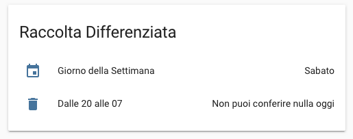

# HomeAssistant-Differenziata ♻️
Lovelace Card per Home Assistant per la raccolta differenziata del tuo comune

Installazione
-------
Copiate nei file configuration.yaml e ui-lovelace.yaml il contenuto dei rispettivi file nelle specifiche sezioni.

### configuration.yaml
    # Da inserire nella sezione sensor:
    # Prodotto da conferire in base al giorno
    # Giorni:
    # 0 = Lunedì, 1 = Martedì, 2 = Mercoledì, ecc...
    # Sostituire il prodotto da conferire in base al giorno della settimana
      sensor:
      - platform: template
        sensors:
          raccoltadifferenziata:
            entity_id: sensor.date
            friendly_name: "Dalle 20 alle 07" #Orario di conferimento
            value_template: >-
              
                Plastica e Indifferenziato
              
                Umido
              
                Carta e Cartone
              
                Indifferenziata
              
                Umido
              
                Non puoi conferire nulla oggi
              
                Umido
              
              
    # Giorno della settimana
    - platform: template
      sensors:
        giornosettimana:
          entity_id: sensor.date
          friendly_name: "Giorno della Settimana"
          value_template: >-
            
              Lunedì
            
              Martedì
            
              Mercoledì
            
              Giovedì
            
              Venerdì
            
              Sabato
            
              Domenica
            

    #Automazione che ogni 2 ore verifica il giorno della settimana e il prodotto da conferire
    #Da inserire nella sezione automation:
    automation:
      - alias: 'differenziata_updater'
        trigger:
          - platform: time_pattern
            minutes: '/120'
            seconds: 0
        action:
          - service: homeassistant.update_entity
            entity_id: sensor.giornosettimana
          - service: homeassistant.update_entity
            entity_id: sensor.raccoltadifferenziata

### ui-lovelace.yaml
    # Lovelace Card per mostrare raccolta differenziata
    # Da inserire dentro la sezione views:
    views:
    - title: Raccolta Differenziata
      icon: mdi:recycle
      cards:
        - type: entities
          title: Raccolta Differenziata
          show_header_toggle: false
          entities:
            - sensor.giornosettimana
            - sensor.raccoltadifferenziata
          card:
            type: glance
            title: Raccolta Differenziata
